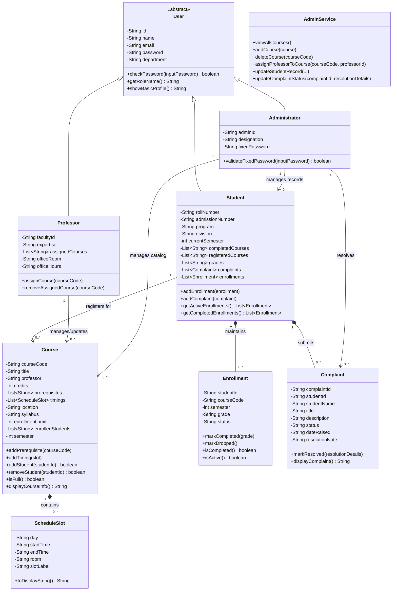

# UML Draft

This file contains the draft UML for the `SVNIT Course Registration System`.

## Class Diagram

## What This UML Covers

- `User` as the abstract base class
- `Student`, `Professor`, and `Administrator` inheritance
- student-to-course relationship through registration/enrollment
- student-to-complaint relationship
- course-to-professor management relationship
- admin control over course records, student records, and complaints
- course composition with timetable slots

## Why This Matches The Assignment

- abstraction is visible through `User`
- inheritance is visible through role subclasses
- encapsulation is reflected through modeled private fields
- polymorphism is reflected through shared role methods
- role separation is visible:
  - student registers and complains
  - professor reads/updates assigned courses only
  - admin manages catalog, records, and complaints

## Final Submission Note

This draft can later be:

- redrawn in a diagram tool
- converted to a hand-drawn UML
- converted to a cleaner final notation for submission

But the structure should remain the same as the implemented code.
